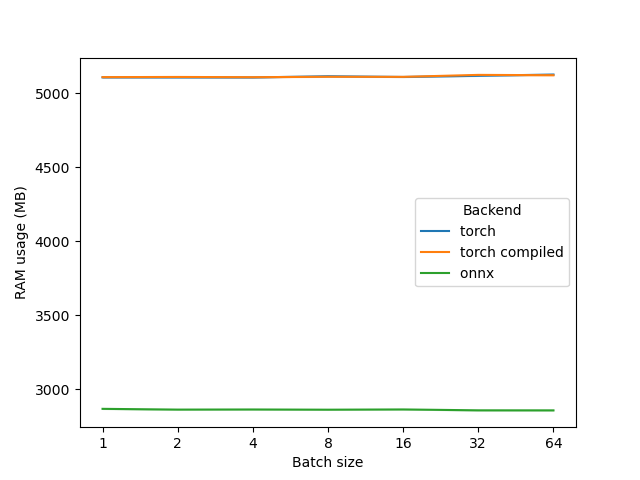

In order to evaluate performance we run few benchmarks.
The first benchmark is for running Protein Langauge Models on CPU in `torch` and `onnxruntime`.

First, we looked in difference in processing different batch sizes.

Next, we looked how ONNX scales with number of threads. The number of threads had only minor effect (5-10%).

The RAM usage differs significantly, showing a better scaling of ONNX and an opprotunity to calculate larger batches, while still over 1000x faster than original.

Finally, we looked into loading times for `torch` and `onnxruntime`. The difference is small.

