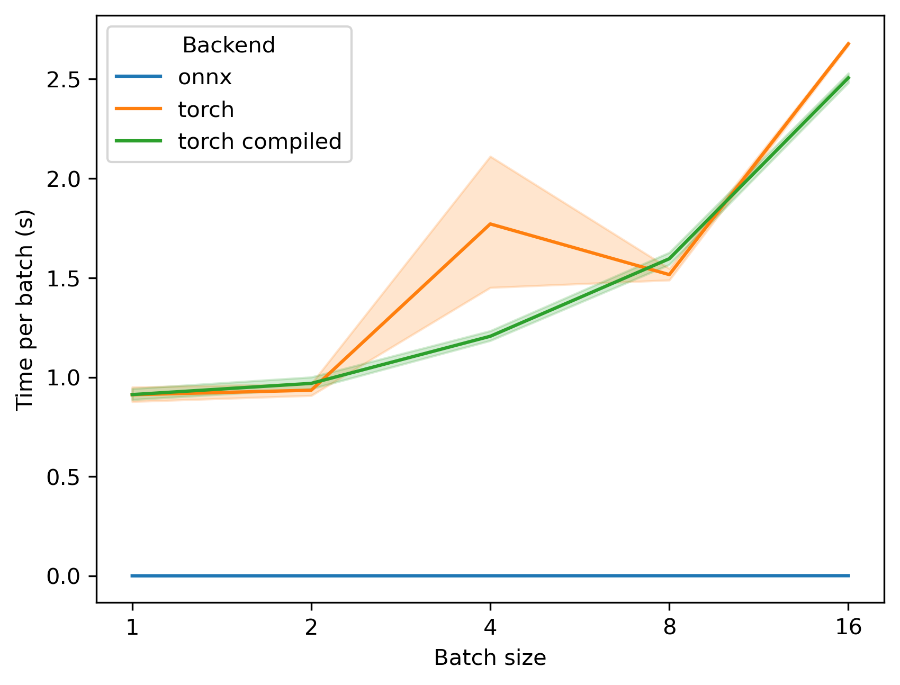
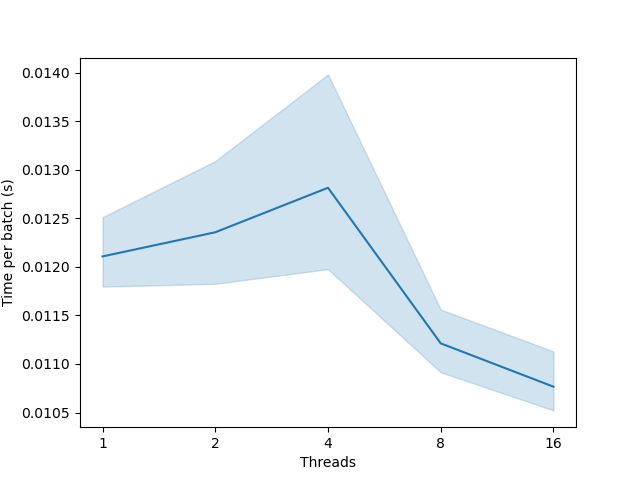
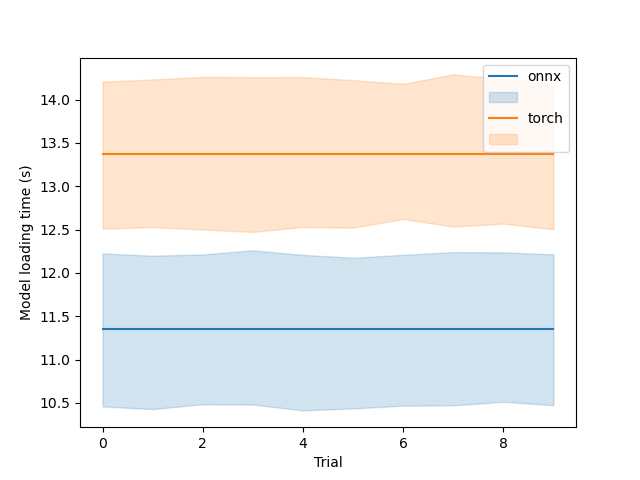

In order to evaluate performance we run few benchmarks.
The first benchmark is for running Protein Langauge Models on CPU in `torch` and `onnxruntime`.

First, we looked in difference in processing different batch sizes.

Next, we looked how ONNX scales with number of threads. ONNX scales very favourably, although this effect is only noticeable with large batch sizes (>64). Otherwise, the speed gains are not noticeable.

Finally, we looked into loading times for `torch` and `onnxruntime`. The difference is small.

